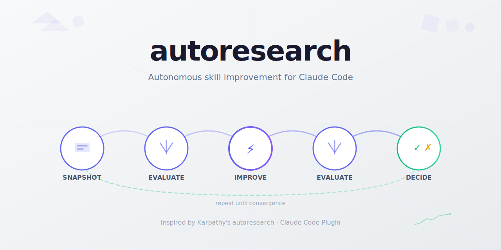
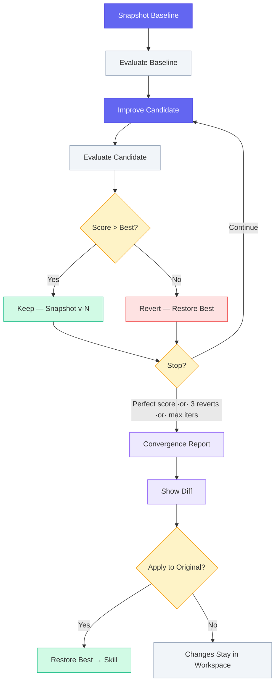
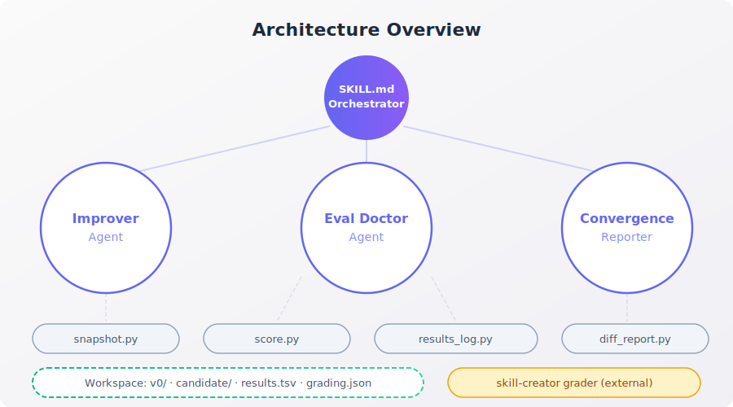

# autoresearch

[](https://github.com/zircote/autoresearch) [](https://python.org) [](tests/) [](docs/) [](LICENSE)

Autonomous skill improvement for Claude Code plugins. Inspired by [Andrej Karpathy's autoresearch](https://github.com/karpathy/autoresearch) — an autonomous improvement loop where AI agents iterate on artifacts while humans sleep. Point it at a skill, walk away, come back to a better skill.

<picture>
  <source media="(prefers-color-scheme: dark)" srcset=".github/social-preview-dark.svg">
  <source media="(prefers-color-scheme: light)" srcset=".github/social-preview.svg">
  
</picture>

Autoresearch runs an improvement loop: modify the skill, evaluate it against fixed evals, keep improvements, discard regressions. Repeat until convergence. No babysitting required.

## Install

```bash
claude plugins add ./
```

## Quick Start

```bash
# Improve a skill automatically
/autoresearch path/to/my-skill

# Create evals for a skill that has none
/autoresearch --eval-doctor path/to/my-skill

# Review results from a previous run
/autoresearch --report path/to/my-skill-autoresearch
```

## How It Works



## Three Modes

### 1. Full Improvement Loop (default)

```bash
/autoresearch path/to/my-skill
/autoresearch path/to/my-skill --iterations 8
```

Runs the complete cycle: snapshot baseline, evaluate, improve, evaluate, keep/discard, repeat. Produces a convergence report and asks whether to apply the best version.

### 2. Eval Doctor

```bash
/autoresearch --eval-doctor path/to/my-skill
```

Creates or fixes evaluation cases for a skill. Run this first when a skill has no `evals/evals.json` or when evals are too easy/hard. Does not run the improvement loop.

### 3. Report

```bash
/autoresearch --report path/to/my-skill-autoresearch
```

Generates a convergence report from an existing workspace. Useful for reviewing results after a run completes.

## Architecture



## Documentation

### Tutorials — Learn by doing
- [Getting Started](docs/tutorials/getting-started.md) — Your first autoresearch loop
- [Creating Evals from Scratch](docs/tutorials/creating-evals-from-scratch.md) — Building evals for a bare skill
- [Improving an Existing Skill](docs/tutorials/improving-an-existing-skill.md) — Taking a skill from 65% to 90%+

### How-To Guides — Solve specific problems
- [Run the Improvement Loop](docs/how-to/run-improvement-loop.md) — Execute the core loop with all options
- [Manage Evals](docs/how-to/manage-evals.md) — Create, fix, update eval cases
- [Interpret Results](docs/how-to/interpret-results.md) — Read results.tsv and convergence reports
- [Customize Iterations](docs/how-to/customize-iterations.md) — Change max iterations, understand abort thresholds
- [Apply Changes](docs/how-to/apply-changes.md) — Review and apply the best version
- [Recover from Failure](docs/how-to/recover-from-failure.md) — Resume after interruption, inspect snapshots
- [Integrate with Skill Creator](docs/how-to/integrate-with-skill-creator.md) — Post-loop description optimization

### Reference — Look up details
- [CLI Reference](docs/reference/cli.md) — Complete command reference
- [Algorithm](docs/reference/algorithm.md) — Formal loop specification
- [File Formats](docs/reference/file-formats.md) — results.tsv, workspace layout, snapshot format
- [Eval Schema](docs/reference/eval-schema.md) — evals.json and trigger-eval.json schemas
- [Agents](docs/reference/agents.md) — Agent specs: improver, eval-doctor, convergence-reporter
- [Scripts](docs/reference/scripts.md) — Script API: snapshot.py, score.py, results_log.py, diff_report.py

### Explanation — Understand the design
- [The Autoresearch Pattern](docs/explanation/the-autoresearch-pattern.md) — Karpathy's pattern and how it maps to skills
- [Eval-Skill Separation](docs/explanation/eval-skill-separation.md) — Why evals and skills improve separately
- [Convergence and Scoring](docs/explanation/convergence-and-scoring.md) — How scoring works, what convergence means
- [Lifecycle](docs/explanation/lifecycle.md) — Full lifecycle from start to finish
- [Component Architecture](docs/explanation/architecture.md) — How orchestrator, agents, and scripts interact
- [Expected Results](docs/explanation/expected-results.md) — Typical score trajectories and failure modes

## Requirements

- Claude Code with plugin support
- The `skill-creator` plugin (provides the grader agent)
- Python 3.8+ (for snapshot, scoring, and reporting scripts)

## License

See [LICENSE](LICENSE).
